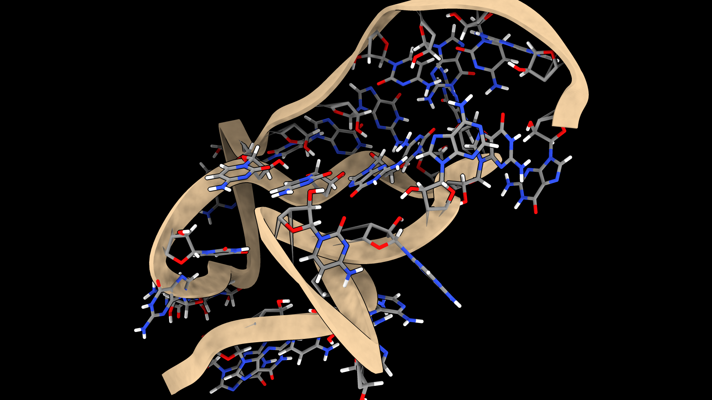

# ChimeraX RNA Batch Screenshot Generator

This repository contains a ChimeraX-compatible Python script for batch-processing RNA 3D structures in PDB format and generating high-quality publication-ready screenshots. The script is intended for use in **headless (nogui) mode** of UCSF ChimeraX, making it ideal for automated pipelines and high-throughput rendering.

---

## 🔍 Overview

The script:

* Loads multiple `.pdb` files from a target folder
* Applies a uniform visual style optimized for RNA molecules
* Adds visual elements like colored base types, ribbon cartoons, and shadows
* Saves each frame as a high-resolution PNG screenshot to a specified folder

---

## 🧬 Visual Style

By default, the script uses a **ball-and-stick model** for nucleotides and a **cartoon ribbon** for the sugar-phosphate backbone. Color coding is applied to highlight base identities:

| Base     | Color  |
| -------- | ------ |
| Adenine  | Red    |
| Guanine  | Blue   |
| Cytosine | Green  |
| Uracil   | Yellow |

Additional features:

* Gray ribbon (cartoon backbone)
* Hydrogens **not hidden** (for detailed atomic views)
* Optional planar glyphs and ladder overlays are **disabled** for clarity
* Adjustable zoom, lighting, silhouette width, and supersampling for rendering quality

---

## 🖥️ Requirements

* [UCSF ChimeraX](https://www.cgl.ucsf.edu/chimerax/)
* Linux or compatible environment where `chimerax --offscreen --script` is available

---

## 🚀 How to Use

### 1. Modify the Configuration

Edit the following line in the script to point to your folder containing `.pdb` files:

```python
folder_path = '/path/to/your/pdb_folder'
```

### 2. Run the Script

Execute the script using ChimeraX in headless mode:

```bash
chimerax --offscreen --script chimera_frames.py
```

This will:

* Sort `.pdb` files numerically
* Load them one by one into ChimeraX
* Apply visual styling
* Save each view as a PNG in `/your/pdb_folder/screenshots/`

---

## ⚙️ Optional Customization

* **Switch to sphere or stick mode**

  ```python
  cmd(session, "style nucleic sphere")
  cmd(session, "size sphereScale 1.0")
  ```
* **Enable base glyphs**

  ```python
  cmd(session, "nucleotides fill")
  cmd(session, "nucleotides ladder radius 0.3")
  ```
* **Hide hydrogens**

  ```python
  cmd(session, "hide H")
  ```

---

## 📸 Output

* All screenshots are saved as `frame0000.png`, `frame0001.png`, ...
* Resolution: 1920x1080
* Supersampling: 3x
* Transparent background: **false**

---

## 🖼 Example Output

Below is an example of the rendered RNA structure:



This frame was generated from a SimRNA replica and reconstructed at rigid-body full-atomic resolution using [`trc2pdb`](https://github.com/Firingam/TRC2PDB).

---

## 📂 Folder Structure

```
project/
├── chimera_frames.py         # The batch rendering script
├── /full_atom/               # Folder with your input .pdb files
└── /full_atom/screenshots/   # Output PNG images will appear here
```

---

## 📜 License

This script is provided under the MIT License. See `LICENSE` file.

---

## 🧠 Acknowledgments

Developed by [Andrea Cappannini](mailto:andrea@molecurna.com) as part of an automated pipeline for RNA structural visualization using UCSF ChimeraX.

---

## 💬 Questions?

Feel free to open an issue or reach out via [andrea@molecurna.com](mailto:andrea@molecurna.com) if you want help integrating this pipeline into your RNA visualization workflows.
